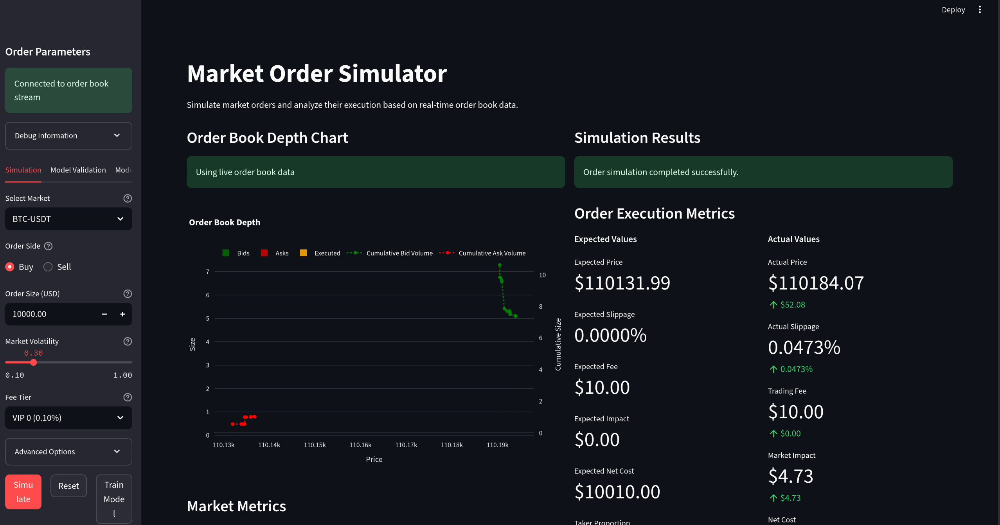
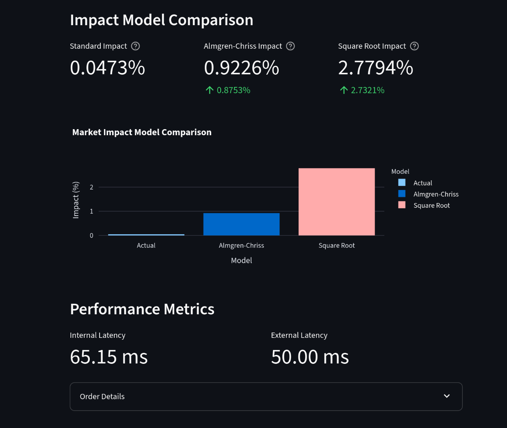

# Quantitative Trading Research and Simulation

This repository contains various tools and simulations for quantitative trading research, including market order simulation, Almgren-Chriss optimal execution, and regression models for market impact.
Started as a submission to one of the open source projects out there as a learning to what is an L2 Ordernotebook and what does it mean to trade in a trading simulation
## Features

- Real-time L2 order book visualization and market order execution simulation.
- Optimal trade execution strategies (Almgren-Chriss).
- Regression models for analyzing market impact.
- Interactive web interfaces for visualization and analysis.

## Project Structure

- `almgren_chriss_calibration.py`: Script for calibrating Almgren-Chriss model parameters.
- `almgren_chriss_example.py`: Example usage of the Almgren-Chriss model.
- `almgren_chriss_params.json`: Configuration for Almgren-Chriss parameters.
- `almgren_chriss.py`: Implementation of the Almgren-Chriss optimal execution model.
- `app.py`: Main Streamlit application for interactive simulations and visualizations.
- `enhanced_regression_models.py`: Advanced regression models for market impact.
- `market_impact_models.md`: Documentation on market impact models.
- `market_order_simulator.py`: Logic for simulating market order execution.
- `model_validation.py`: Scripts for validating models.
- `orderbook_client.py`: WebSocket client for order book data.
- `orderbook.py`: Data structure for maintaining L2 order book state.
- `regression_models.py`: Basic regression models for market impact.
- `requirements.txt`: Python dependencies.
- `slippage_data.csv`: Sample data for slippage analysis.

## Visualizations

### Dashboard Overview

### Model Comparison

## License

MIT
